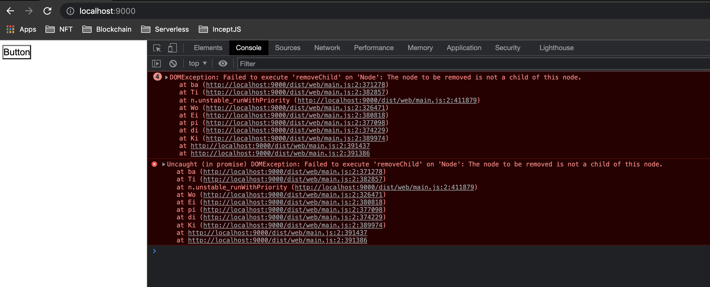
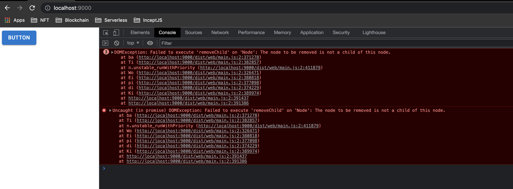
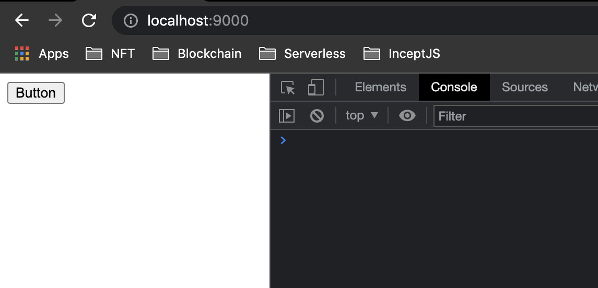

# loadable-ui-issue

Explains an Issue with @loadable, Material UI 5 and Chakra (could be 
other UIs). The basis of this code structure follows the `@loadable` 
SSR example found 
[here](https://github.com/gregberge/loadable-components/tree/main/examples/server-side-rendering).

## Setup

```bash
$ npm i
$ npm run build
$ npm run dev
```

## The Issue

Next in your browser open up "Dev Tools > Console" and go to 
`http://localhost:9000/`. You should see something like this.



The error starts from `src/client/App.js` which exports `App3`. The 
`<App />` code looks like this.

```js
import React from 'react'
import loadable from '@loadable/component'

const Vanilla = loadable(_ => import('./Vanilla'))
const Material = loadable(_ => import('./Material'))
const Chakra = loadable(_ => import('./Chakra'))

const App1 = () => <Vanilla />
const App2 = () => <Material />
const App3 = () => <Chakra />

export default App3
```

If you export `App2` which is Material UI 5, you will get the same error.



And if you export `App1` which is a no UI library HTML button you will 
get no errors.



## The Versions

The following examples use the latest versions of packages to this date 
of **12 October 2021**.

 - Babel 7
 - Webpack 5
 - Express 4
 - React 17
 - Loadable 5
 - CSS Loader 6

## Recreate

The basis of this code structure follows the `@loadable` SSR example found 
[here](https://github.com/gregberge/loadable-components/tree/main/examples/server-side-rendering).

What I specifically did was the following.

 - Upgrade the package versions to the latest
 - Removed all the `letter` components
 - Made a component for `vanilla`, `material` and `chakra`
